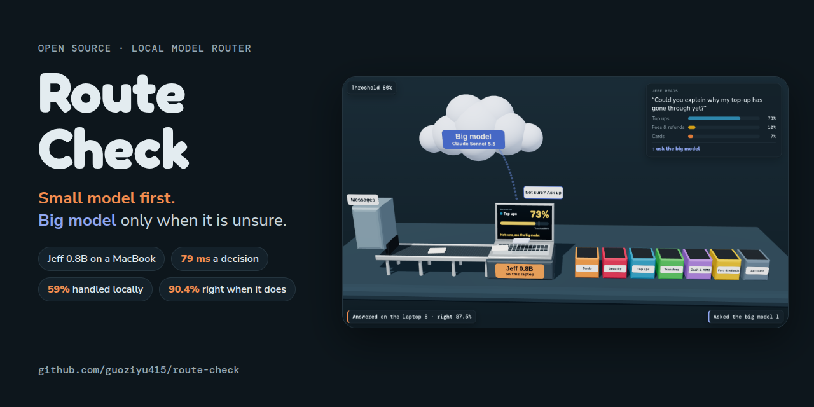
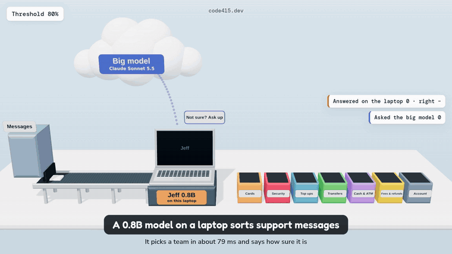

<p align="center">
  
</p>

<p align="center">
  <b>Can a small model on your laptop handle most of your routing, and call a big model only when it is unsure?</b><br>
  Route Check measures that on your own labeled examples, then lets you pick the confidence threshold and see what you save.
</p>

<p align="center">
  <a href="https://code415.dev/demos/2026-09-29/route-check"></a>
  
  
  <a href="LICENSE"></a>
</p>

<p align="center">
  <a href="https://code415.dev/demos/2026-09-29/route-check"><b>Live demo</b></a> ·
  <a href="#results-on-banking77"><b>Results</b></a> ·
  <a href="#quick-start"><b>Quick start</b></a> ·
  <a href="#your-own-data"><b>Your own data</b></a> ·
  <a href="#how-it-works"><b>How it works</b></a>
</p>

<br>

<p align="center">
  
</p>

<p align="center"><sub>Messages come in on the left. Jeff, a 0.8B model on the laptop, gives every team a probability. Sure enough, the message goes straight to a team. Not sure, it goes up to the big model, and that is the only call that costs money.</sub></p>

## Why

A lot of LLM traffic is a multiple choice question in disguise: which team gets this ticket, which intent is this, is this spam. Sending every one of those to a frontier model works, but you pay for every call and wait for the network.

[Jeff](https://github.com/firelex/jeff) by firelex is a small decision model built for exactly this. It reads the situation and your options, runs one forward pass and returns a probability for each option. No generated text, no parsing. The 0.8B version is 1.7 GB and runs on a MacBook with MLX.

If those probabilities are honest, the plan is simple: **answer locally when the small model is sure, escalate when it is not.** The open question is where to put the line, and the only way to know is to measure on your own data. That is what this repo does.

## Results on Banking77

2,960 real online banking questions from [Banking77](https://github.com/PolyAI-LDN/task-specific-datasets) (PolyAI, CC BY 4.0), grouped into 7 support teams: Cards, Security, Top ups, Transfers, Cash and ATMs, Fees and refunds, Account. Jeff-Qwen3.5-0.8B, MLX, MacBook Pro with M4 Pro, one message at a time.

| Threshold | Answered on the laptop | Right when it answers | Sent to the big model |
|---:|---:|---:|---:|
| none | 100% | 80.5% | 0% |
| 0.60 | 79.6% | 86.5% | 20.4% |
| 0.70 | 69.8% | 89.1% | 30.2% |
| **0.80** | **59.0%** | **90.4%** | **41.0%** |
| 0.90 | 43.5% | 92.1% | 56.5% |
| 0.95 | 29.8% | 94.0% | 70.2% |
| 0.98 | 16.8% | 97.4% | 83.2% |

- **Speed:** median 79 ms per decision including the HTTP call and a prompt with all 7 team descriptions. The whole set took 4 minutes.
- **Cost:** at 100,000 messages a day, 250 input and 5 output tokens each, sending everything to Claude Sonnet 5.5 ($2 / $10 per million tokens) is $55 a day. With a 0.80 threshold the laptop takes 59% of that, about **$970 a month** saved. On Claude Opus 5.5 it doubles.
- **Calibration:** when Jeff says 95% or more (883 messages) it is right 94.0% of the time, when it says 90 to 95% it is right 87.9%, and when it says 40 to 50% it is right 59.8%. Slightly overconfident at the top, underconfident at the bottom. Expected calibration error is 5.1 points. The Jeff authors do not publish this number, so we measured it.
- **Where it struggles:** Cash and ATMs (53.5% right, often sent to Cards), and fee questions that mention a top up or a transfer. Account questions are 99.4% right.
- **Label quirks:** some confident "mistakes" are arguable. Banking77 files several "my card got declined while shopping" messages under `declined_transfer`, and our grouping counts "Is there a fee for topping up" as Fees. We kept every label as is.

The full per message results are in [`results/`](results/). Open them on the [live page](https://code415.dev/demos/2026-09-29/route-check) to move the threshold, see every message and the three kinds of outcome.

## Quick start

On an Apple silicon Mac:

```bash
git clone https://github.com/guoziyu415/route-check
cd route-check && bash run_on_mac.sh
```

The script clones Jeff, installs its dependencies with [uv](https://docs.astral.sh/uv/) (a private copy in `.uv/` if yours is missing or too old), downloads Jeff-Qwen3.5-0.8B from Hugging Face (about 1.7 GB, first run only), starts the server on port 8765, runs the 2,960 messages and prints the table above. Results go to `results-banking77.json`.

Try the 2B model with `JEFF_MODEL=mstrasser/Jeff-Qwen3.5-2B bash run_on_mac.sh`.

On Linux with a GPU, start Jeff the way its [README](https://github.com/firelex/jeff) describes, then point the script at it:

```bash
python3 route_check.py --url http://127.0.0.1:8765 \
  --data data/banking77_routes.jsonl --question data/banking77_question.json
```

`route_check.py` only uses the Python standard library.

## Your own data

Two files. One labeled example per line:

```json
{"text": "I was charged twice this month, can you refund one of them?", "label": "1"}
{"text": "The export button does nothing when I click it in Safari.", "label": "2"}
```

And the question with your options, keyed by the labels:

```json
{
  "instructions": "Which queue should this support ticket go to?",
  "criteria": {
    "1": "Billing: charges, invoices, refunds, plan changes",
    "2": "Bug: something in the product is broken or shows an error",
    "3": "Account: sign in, password, two factor, deleting the account",
    "4": "Feature request: asking for something the product does not do yet"
  }
}
```

Then:

```bash
bash run_on_mac.sh --data my_tickets.jsonl --question my_question.json --out my-results.json
```

Drop `my-results.json` on the [live page](https://code415.dev/demos/2026-09-29/route-check). It is read in your browser and never uploaded. Or print the table in the terminal:

```bash
python3 route_check.py --report my-results.json
```

A few hundred examples is enough to see the curve. Released Jeff models handle up to 26 options, in English. Write each option the way you would explain it to a new teammate, the descriptions matter.

## How it works

For every example, `route_check.py` sends one request to Jeff's `/v1/systemone` endpoint and stores the probability of every option, the top choice and the time taken. The "how sure" number is the top probability. Jeff also returns a rescaled `confidence` field; we use the raw top probability because that is what a threshold acts on.

For a threshold *t*, every example whose top probability is at least *t* counts as answered locally, the rest as escalated. Sorting by probability once gives the whole curve: share answered locally against accuracy of those answers. The "aim for 90%" buttons pick the lowest threshold whose local answers reach that accuracy on your data, which keeps as much as possible on the laptop.

The page adds three things you supply: messages per day, tokens per call and how often the big model gets the escalated ones right. Only big model calls are counted as cost; electricity for the laptop is ignored. Nothing on the page talks to a server.

## Files

| Path | What |
|---|---|
| `route_check.py` | The measuring tool and `--report` table. Standard library only. |
| `run_on_mac.sh` | Sets up Jeff on Apple silicon and runs the test. |
| `data/` | Banking77 routing set, the 7 team question, the intent to team mapping. |
| `results/` | Our run on an M4 Pro MacBook Pro. |
| `examples/` | A tiny ticket set to copy the format from. |
| `docs/index.html` | The page, self contained. |

## Credits

- [Jeff](https://github.com/firelex/jeff) by firelex, code MIT, weights Apache 2.0.
- [Banking77](https://github.com/PolyAI-LDN/task-specific-datasets) by PolyAI, CC BY 4.0. Casanueva et al., 2020, *Efficient Intent Detection with Dual Sentence Encoders*.
- Prices from Anthropic's published API rates on September 29, 2026.

Made by [@Code415zg](https://x.com/Code415zg) for [Code415 Radar](https://code415.dev), vibe coded with Claude. MIT license.
